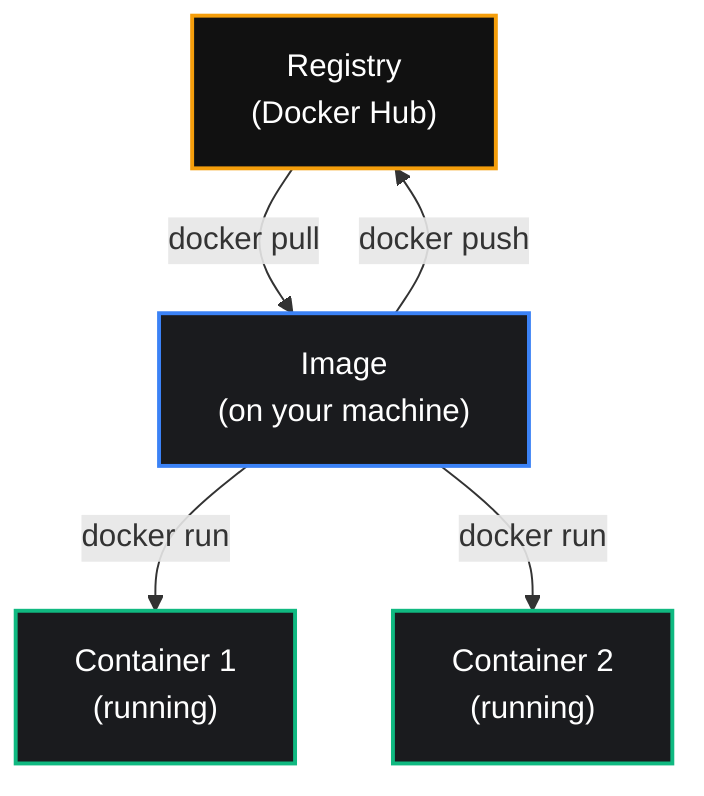

import { Callout } from 'nextra/components'

# Core Concepts

<Callout type="info">
Three words show up constantly in Docker: image, container, and registry. Once these are clear, everything else becomes much easier to understand.
</Callout>

## Image

An **image** is a packaged snapshot of an app and everything it needs to run: the code, the runtime (like Node.js), libraries, and configuration.

An image does not run by itself. It is a blueprint — a read-only template sitting on disk, waiting to be started.

<Callout type="default">
Think of an image like a recipe. The recipe itself is not food — it is the instructions for making food.
</Callout>

## Container

A **container** is a running instance of an image. When you start an image, Docker creates a container from it.

You can start the same image multiple times, and each time you get a separate, independent container.

<Callout type="default">
If the image is the recipe, the container is the actual dish you cooked from it. You can cook the same recipe many times and get many separate dishes.
</Callout>

| | Image | Container |
|---|---|---|
| **What it is** | A blueprint / template | A running process created from an image |
| **State** | Read-only, does not change | Runs, can be started and stopped |
| **Can you have many?** | One image | Many containers from one image |

## Registry

A **registry** is a place where images are stored and shared, similar to how GitHub stores code.

The most common registry is **Docker Hub** — a public library of images. When you ran `docker run hello-world` on the previous page, Docker downloaded the `hello-world` image from Docker Hub.

Notice the image only needs to be pulled **once**. From that single image, you can run as many containers as you want — each one separate and independent, just like the recipe analogy above.

You can also **push** your own images to a registry, so other machines — a teammate's laptop, or a production server — can pull and run them.

## Putting It Together

Here is the full flow, from a public image to a running container:

1. An image is stored on a **registry** (like Docker Hub).
2. You **pull** the image down to your machine.
3. You **run** the image, which creates a **container**.
4. The container is a live, running process you can stop, restart, or remove.

<Callout type="warning">
A container is temporary by default. If you remove it, anything that changed inside it is lost, unless you specifically saved that data outside the container. You will learn how to handle this properly when we cover volumes in a later section.
</Callout>

## Quick Check

- [ ] Can you explain the difference between an image and a container in your own words?
- [ ] Do you know what a registry is, and can you name one?
- [ ] Do you understand why one image can create many containers?

**Next →** [Your First Container](/docs/docker/first-container)

  docker image vs container, what is a docker registry, docker hub explained, docker core concepts

