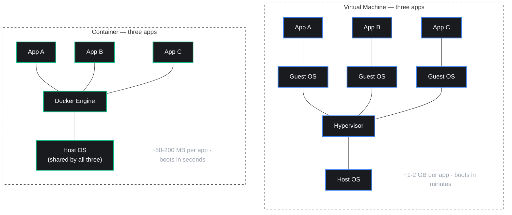

import { Callout } from 'nextra/components'

# What is Docker

<Callout type="info">
This page explains the problem Docker solves, and introduces the idea of a container.
</Callout>

## The Problem

You build a web app on your laptop. It works fine. You send it to a teammate, or you deploy it to a server, and it breaks.

This happens for reasons like:

- Your laptop has Node.js version 20. The server has version 16.
- Your database is PostgreSQL 16. The server runs PostgreSQL 12.
- A system library your app depends on is missing on the server.

Developers call this **"it works on my machine"**. It is one of the most common and most frustrating problems in software development.

## The Idea Behind Docker

Docker solves this by packaging your app together with everything it needs to run: the code, the runtime (Node.js), the libraries, and the settings.

This package is called a **container**. A container runs the same way on any machine that has Docker installed — your laptop, a teammate's laptop, or a production server.

<Callout type="default">
Think of a container like a sealed shipping box. What is inside the box does not change based on which truck, ship, or warehouse it travels through. Docker containers work the same way — the app runs identically everywhere.
</Callout>

## Containers vs Virtual Machines

Before Docker, developers solved this problem with **virtual machines (VMs)**. A VM works too, but it is heavy — each VM includes a full copy of an operating system.

A container is lighter. It shares the host machine's operating system kernel instead of including its own.

| | Virtual Machine | Container |
|---|---|---|
| **Includes a full OS** | Yes | No — shares the host OS |
| **Typical size** | Gigabytes | Megabytes |
| **Startup time** | Minutes | Seconds |
| **Resource use** | Heavy | Light |

Both sides run the same three apps, so the comparison is fair. On the virtual machine side, each app carries its own full Guest OS — that weight repeats three times. On the container side, all three apps share one Docker Engine and one Host OS underneath. This is why servers can run far more containers than virtual machines on the same hardware.

Because containers are lighter, you can run many of them on one machine, and they start almost instantly.

## Why This Matters for You

As a developer, Docker gives you three practical wins:

- **Consistency** — the app behaves the same on your machine, your teammate's machine, and the production server.
- **Isolation** — you can run multiple projects on one laptop, each with a different Node.js or database version, without conflicts.
- **Easy deployment** — you send the same container to any server, instead of manually installing dependencies there.

## Quick Check

- [ ] Can you explain "it works on my machine" in your own words?
- [ ] Do you understand why a container is lighter than a virtual machine?
- [ ] Can you name two practical benefits Docker gives a developer?

**Next →** [Installation](/docs/docker/installation)

  what is docker, docker vs virtual machine, docker container explained, why use docker, docker for beginners

