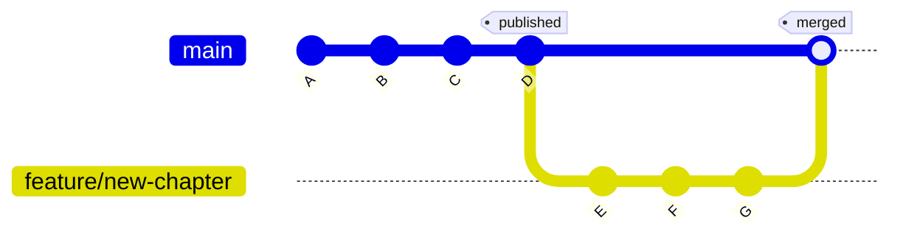

import { Callout, Steps, Tabs, FileTree } from 'nextra/components'

# Branching & Merging

<Callout type="info" emoji="⚡">
**Essential** | Estimated time: 60–90 minutes

Branch হলো Git-এর সবচেয়ে powerful feature। এটা বোঝার পর তুমি বুঝবে কেন পুরো দুনিয়া Git ব্যবহার করে।

</Callout>

## What You'll Learn

- Branch কী এবং কেন দরকার
- Branch বানানো, switch করা, delete করা
- Branch naming convention (real company style)
- Merge করা — branch-এর কাজ main-এ আনা
- Merge conflict — কী হয়, কীভাবে fix করে
- `git stash` — কাজের মাঝে হঠাৎ switch করতে হলে

## Branch Overview

ব্রাঞ্চ কীভাবে কাজ করে তার একটি সহজ মানসিক ধারণা (Mental Model) বুঝে নাও।

কল্পনা করো তুমি একটা বইয়ের writer। বইটা already published — সেটা হলো `main` branch।

এখন তুমি নতুন একটা chapter লিখতে চাও। কিন্তু সরাসরি published বই-এ লিখবে না, তাই না? তুমি একটা **আলাদা draft খাতা** নেবে, সেখানে লিখবে, edit করবে — যখন ready হবে তখন published বই-এ যোগ করবে।

Git-এ সেই **আলাদা draft খাতাটাই হলো branch।**

নিচের ডায়াগ্রামটি খেয়াল করো:
- `main` branch: তোমার বইয়ের পাবলিশড অংশ (Commits A থেকে D).
- `feature/new-chapter` branch: নতুন চ্যাপ্টার লেখার ড্রাফট খাতা (Commits E, F, G).
- Merge: কাজ শেষে ড্রাফট অংশটি আবার `main` বইয়ের সাথে যুক্ত করা হয়েছে।



<Callout type="info">
  **Real life-এ কেন দরকার:**
  
  - তুমি নতুন feature বানাচ্ছ, teammate bug fix করছে — দুইজন আলাদা branch-এ কাজ করবে, একজন আরেকজনের কাজ নষ্ট করবে না
  - কোনো feature half-done থাকলেও `main` branch সবসময় working থাকবে
  - কিছু ভুল হলে branch delete করে দাও — main অক্ষত থাকবে
</Callout>

## Basic Commands

ব্রাঞ্চ তৈরি করা, ডিলিট করা এবং এক ব্রাঞ্চ থেকে অন্য ব্রাঞ্চে যাওয়ার কমান্ডগুলো দেখো।

<Tabs items={['নতুন Branch', 'Switch করা', 'বানানো + Switch', 'সব Branch দেখা', 'Delete করা']}>
  <Tabs.Tab>
    ```bash filename="Terminal"
    git branch feature/login-page
    ```
    এটা শুধু branch বানায়, switch করে না।
  </Tabs.Tab>
  <Tabs.Tab>
    ```bash filename="Terminal"
    git switch feature/login-page
    ```
    Output: `Switched to branch 'feature/login-page'`
  </Tabs.Tab>
  <Tabs.Tab>
    ```bash filename="Terminal"
    git switch -c feature/login-page
    ```
    `-c` মানে "create"। এটাই সবচেয়ে বেশি ব্যবহার হয়।
  </Tabs.Tab>
  <Tabs.Tab>
    ```bash filename="Terminal"
    # Local branch দেখতে
    git branch
    
    # Local + Remote সব branch দেখতে
    git branch -a
    ```
  </Tabs.Tab>
  <Tabs.Tab>
    ```bash filename="Terminal"
    # Local branch delete (merge হয়ে গেলে)
    git branch -d feature/login-page

    # Force delete (merge না হলেও)
    git branch -D feature/login-page
    ```

  </Tabs.Tab>
</Tabs>

<Callout type="info">
  **Pro Tip:** Branch delete করলে সেই branch-এর commits হারায় না — যদি merge
  হয়ে থাকে। Merge হওয়া মানে সেই কাজ main-এ চলে গেছে।
</Callout>

## Naming Convention

পেশাদার কোম্পানিগুলোতে ব্রাঞ্চের নাম দেওয়ার কিছু স্ট্যান্ডার্ড নিয়ম।

Real company-তে branch-এর নাম দেখলেই বোঝা যায় সে কী করছে। এটা একটা standard follow করে:

| Prefix     | কখন ব্যবহার                     | উদাহরণ                  |
| ---------- | ------------------------------- | ----------------------- |
| `feature/` | নতুন কিছু বানাচ্ছ               | `feature/user-login`    |
| `fix/`     | Bug fix করছ                     | `fix/broken-navbar`     |
| `hotfix/`  | Live site-এ emergency fix       | `hotfix/payment-crash`  |
| `chore/`   | Code cleanup, dependency update | `chore/update-packages` |
| `docs/`    | Documentation লিখছ              | `docs/api-guide`        |

<Tabs items={["❌ খারাপ নাম", "✅ ভালো নাম"]}>
  <Tabs.Tab>
    ```bash filename="Terminal"
    mybranch
    test
    new
    fix1
    asdf
    ```
  </Tabs.Tab>
  <Tabs.Tab>
    ```bash filename="Terminal"
    feature/product-search
    fix/login-redirect-bug
    hotfix/checkout-500-error
    docs/readme-update
    ```
  </Tabs.Tab>
</Tabs>

## Branch Workflow

একটি বাস্তব উদাহরণের মাধ্যমে ব্রাঞ্চিং এর পুরো কাজ শুরু থেকে শেষ পর্যন্ত দেখো।

একটা real scenario দিয়ে দেখি। ধরো তুমি একটা website-এ কাজ করছ এবং নতুন "Contact Us" page বানাতে হবে।

<Steps>
### Checkout & Pull
আগে main-এ যাও এবং latest নামাও:

```bash filename="Terminal"
git switch main
git pull
```

### Create Branch

নতুন branch বানাও:

```bash filename="Terminal"
git switch -c feature/contact-page
```

### Work and Commit

কিছু file বানাও এবং commit করো:

```bash filename="Terminal"
touch contact.html
echo "<h1>Contact Us</h1>" > contact.html

git add contact.html
git commit -m "Add contact page with basic structure"
```

### Continuous Work

আরও কাজ করো এবং সেগুলোকেও গিটের মাধ্যমে ট্র্যাক করো।

আরও কাজ করো, আরও commit করো:

```bash filename="Terminal"
echo "<p>Email: hello@example.com</p>" >> contact.html
git add contact.html
git commit -m "Add email address to contact page"
```

### Push Branch

তোমার তৈরি করা লোকাল ব্রাঞ্চটি গিটহাবে আপলোড করো।

Branch GitHub-এ push করো:

```bash filename="Terminal"
git push -u origin feature/contact-page
```

এখন তোমার branch GitHub-এও আছে। Teammate দেখতে পাবে।

</Steps>

## Merge Branches

এক ব্রাঞ্চের কাজ অন্য ব্রাঞ্চে (সাধারণত মেইন ব্রাঞ্চে) যুক্ত করার প্রক্রিয়া।

Branch-এর কাজ শেষ। এখন সেটা `main`-এ আনতে হবে।

```bash filename="Terminal"
# প্রথমে main-এ যাও
git switch main

# latest pull করো
git pull

# feature branch merge করো
git merge feature/contact-page
```

Output (smooth merge হলে):

```
Updating a1b2c3d..e4f5g6h
Fast-forward
 contact.html | 2 ++
 1 file changed, 2 insertions(+)
 create mode 100644 contact.html
```

<Callout type="info">
**Clean up:** Merge হয়ে গেলে branch আর দরকার নেই।

```bash filename="Terminal"
# Local branch delete
git branch -d feature/contact-page

# GitHub থেকেও delete করো
git push origin --delete feature/contact-page
```

</Callout>

## Merge Conflict

একই ফাইলে একাধিক পরিবর্তন এলে কীভাবে তা ম্যানুয়ালি ফিক্স করতে হয়।

### Conflict Causes

কখন এবং কেন গিট মার্জ কনফ্লিক্ট তৈরি হয় সেটি বুঝে নাও।

তুমি আর তোমার teammate **একই file-এর একই line** দুইজন দুইভাবে edit করলে Git বুঝতে পারে না কোনটা রাখবে। তখন সে তোমাকে জিজ্ঞেস করে — "তুমি ঠিক করো।"

### Conflict Syntax

কনফ্লিক্ট লাগলে কোড ফাইলের ভেতরে যা পরিবর্তন আসে তা চিনে নাও।

```bash filename="Terminal"
git merge feature/about-page
```

Output:

```
Auto-merging index.html
CONFLICT (content): Merge conflict in index.html
Automatic merge failed; fix conflicts and then commit the result.
```

`index.html` file খুললে দেখবে:

```html
<<<<<<< HEAD
<title>My Awesome Website</title>
=======
<title>My Portfolio Website</title>
>>>>>>> feature/about-page
```

### Resolve Conflict

সহজ কিছু ধাপের মাধ্যমে মার্জ কনফ্লিক্ট সমাধান করার নিয়ম।

তোমাকে decide করতে হবে কোনটা রাখবে। তিনটা option:

<Tabs
  items={[
    "Option A: তোমারটা রাখো",
    "Option B: তাদেরটা রাখো",
    "Option C: দুইটা মিলিয়ে দাও",
  ]}
>
  <Tabs.Tab>
    ```html
    <title>My Awesome Website</title>
    ```
  </Tabs.Tab>
  <Tabs.Tab>
    ```html
    <title>My Portfolio Website</title>
    ```
  </Tabs.Tab>
  <Tabs.Tab>
    ```html
    <title>My Awesome Portfolio</title>
    ```
  </Tabs.Tab>
</Tabs>

Fix করার পর `<<<<<<<`, `=======`, `>>>>>>>` lines গুলো **সব মুছে দাও।**

তারপর:

```bash filename="Terminal"
git add index.html
git commit -m "Merge feature/about-page: resolve title conflict"
```

<Callout type="info">
  **VS Code Conflict Helper:** VS Code conflict দেখলে automatically "Accept
  Current Change / Accept Incoming Change / Accept Both" বাটন দেখায়। Button
  click করলেই হয়, manually edit করতে হয় না।
</Callout>

### Prevent Conflicts

ভবিষ্যতে মার্জ কনফ্লিক্ট কমিয়ে আনার কিছু কার্যকরী টিপস।

- কাজ শুরুর আগে সবসময় `git pull` করো
- ছোট ছোট commits করো, বড় না
- একই file-এ দুইজন কাজ করলে আগে থেকে বলে রাখো

## Git Stash

অর্ধেক করা কাজগুলো সাময়িকভাবে জমা রাখা এবং পরে আবার শুরু করার উপায়।

### Stash Scenarios

কখন তোমার গিট স্ট্যাশ কমান্ডটি ব্যবহার করা উচিত সেটি বুঝে নাও।

তুমি `feature/login` branch-এ কাজ করছ — অর্ধেক হয়েছে, commit করার মতো না। হঠাৎ boss বলল "main branch-এ একটা critical bug fix করো এখনই।"

তুমি কী করবে? Half-done কাজ commit করবে? সব delete করবে?

**না — stash করবে।** Stash হলো একটা **temporary drawer** — কাজ সেখানে রেখে দাও, পরে ফিরে এসে নাও।

<Steps>
### Stash Changes

অর্ধেক কাজগুলো স্ট্যাশ ড্রয়ারে জমা রাখার কমান্ড।

```bash filename="Terminal"
# সব current changes stash করো
git stash
```

এখন তোমার working directory clean — যেন কিছু হয়নি।

### Emergency Work

স্ট্যাশ করার পর তুমি এখন অন্য ব্রাঞ্চে জরুরি কাজ করতে পারো।

```bash filename="Terminal"
git switch main
# bug fix করো
git add .
git commit -m "Fix critical navigation bug"
git push
```

### Restore Stash

জরুরি কাজ শেষ করে আবার স্ট্যাশ থেকে আগের কাজে ফিরে আসার নিয়ম।

```bash filename="Terminal"
git switch feature/login

# stash থেকে কাজ ফিরিয়ে আনো
git stash pop
```

তোমার আগের সব কাজ ফিরে আসবে — যেন কিছুই হয়নি।

</Steps>

### Stash Operations

স্ট্যাশে রাখা কাজগুলো দেখার এবং ম্যানেজ করার প্রয়োজনীয় কমান্ডসমূহ।

```bash filename="Terminal"
git stash list                # একাধিক Stash দেখো
git stash apply stash@{1}     # Specific Stash Apply করো
git stash drop                # সবচেয়ে latest stash delete
git stash clear               # সব stash clear করো
```

## Team Workflow

একটি প্রোফেশনাল টিমে প্রতিদিন যেভাবে ব্রাঞ্চ ব্যবহার করে কাজ করা হয়।

এখন সব একসাথে দেখি। ধরো তুমি একটা team-এ কাজ করছ।

```bash filename="Terminal"
# ১. সকালে কাজ শুরু — latest নামাও
git switch main
git pull

# ২. নতুন feature-এর জন্য branch বানাও
git switch -c feature/search-bar

# ৩. কাজ করো
git add .
git commit -m "Add search bar UI to header"

git add .
git commit -m "Connect search bar to product API"

# ৪. কাজ শেষ — GitHub-এ push করো
git push -u origin feature/search-bar

# ৫. এখন Pull Request বানাবে GitHub-এ
# Teammate review করবে, approve করবে
# তারপর main-এ merge হবে

# ৬. Merge হওয়ার পর local cleanup
git switch main
git pull
git branch -d feature/search-bar
```

## Common Problems & Fixes

<Tabs
  items={[
    "Already up to date",
    "Checkout Error",
    "Wrong Branch",
    "Deleted Remote Branch",
  ]}
>
  <Tabs.Tab>
    **Problem:** "Already up to date" কিন্তু merge হচ্ছে না। **কারণ:** তোমার
    feature branch-এ main-এর সব commits আছে। `git log --oneline` দিয়ে দেখো।
  </Tabs.Tab>
  <Tabs.Tab>
    **Problem:** `Your local changes to the following files would be overwritten
    by checkout` **Fix:** হয় `git stash` করো, নয় `git add . && git commit` করো
    — তারপর switch করো।
  </Tabs.Tab>
  <Tabs.Tab>
    **Problem:** ভুল branch-এ commit করে ফেলেছি

    **Fix:** 
    ```bash filename="Terminal"
    git reset HEAD~1
    git switch correct-branch
    git add .
    git commit -m "message"
    ```
  </Tabs.Tab>
  <Tabs.Tab>
    **Problem:** Remote branch delete করার পর local-এ এখনো দেখাচ্ছে 

    **Fix:**
    ```bash filename="Terminal"
    git fetch --prune
    ```
  </Tabs.Tab>
</Tabs>

## What's Next?

Branch এবং merge শেখা হয়ে গেছে। এখন শিখবে GitHub-এর সাথে properly কাজ করা — SSH, remote, Pull Request সব।

<Callout type="info">
**→ GitHub Essentials**

তোমার local Git এবং GitHub-এর মধ্যে bridge কীভাবে কাজ করে, Pull Request কী এবং কীভাবে করতে হয় — সব এখানে।

</Callout>


<span style={{ display: 'none' }}>
  Search Keywords: create branch, switch branch, merge branch, delete branch, resolve merge conflicts, git stash
</span>
