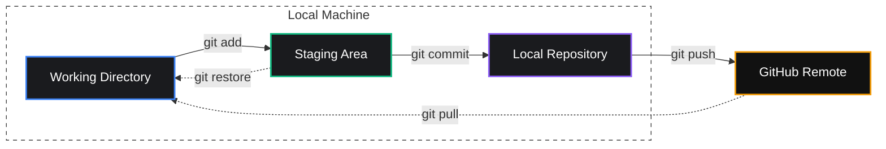

import { Callout, Steps, Tabs, FileTree } from 'nextra/components'

# The Core Loop

<Callout type="info" emoji="⚡">
**Essential** | Estimated time: 45–60 minutes

এই সেকশনটি Git-এর মূল ভিত্তি (Core)। এখানে যা শিখবে সেটা প্রতিদিন ব্যবহার করবে — চাকরিতে হোক, client project-এ হোক, বা নিজের project-এ।

</Callout>

## What You'll Learn

- `git init` — নতুন project-এ Git শুরু করা
- `git clone` — GitHub থেকে project নামানো
- `git add` — কোন changes save করবে সেটা select করা
- `git commit` — changes permanently record করা
- `git push` — GitHub-এ upload করা
- `git pull` — GitHub থেকে latest changes নামানো
- `git status` এবং `git log` — কী হচ্ছে সেটা দেখা
- `.gitignore` — কোন files Git track করবে না সেটা বলা

## The Big Picture

Git কীভাবে কাজ করে এটা বোঝা খুব জরুরি। কাজ শুরু করার আগে একটা mental model বুঝে নাও। Git-এর মূল ওয়ার্কিং ফ্লো (Working Flow) অনুযায়ী তোমার কোড মূলত চারটি ধাপে বা জায়গায় কাজ করে:



সহজ কথায়:

<Steps>
### Working Directory
তুমি file edit করো

### Staging Area
`git add` করো (save করার list-এ উঠল)

### Repository
`git commit` করো (permanently recorded)

### GitHub
`git push` করো (internet-এ গেল)
</Steps>

## Start Project

নতুন প্রোজেক্ট শুরু করা বা গিটহাব থেকে ক্লোন করার প্রক্রিয়া দেখে নাও।

<Tabs items={['Option A: নিজে শুরু (git init)', 'Option B: GitHub থেকে (git clone)']}>
  <Tabs.Tab>
    তুমি নতুন একটা project বানাচ্ছ, GitHub-এ এখনো কিছু নেই।

    ```bash filename="Terminal"
    # প্রথমে একটা folder বানাও
    mkdir my-first-project
    cd my-first-project

    # এই folder-এ Git চালু করো
    git init
    ```

    Output:
    ```
    Initialized empty Git repository in /home/you/my-first-project/.git/
    ```

    এই মানে `.git` নামে একটা hidden folder তৈরি হয়েছে। এই folder-এই Git তোমার সব history রাখে।

    <Callout type="info">
    **Pro Tip:** `git init` শুধু একবার করতে হয় — project-এর শুরুতে। বারবার করতে হয় না।
    </Callout>

  </Tabs.Tab>
  <Tabs.Tab>
    কোনো existing project আছে GitHub-এ, সেটা তোমার machine-এ নামাতে চাও।

    ```bash filename="Terminal"
    git clone git@github.com:username/repository-name.git
    ```

    উদাহরণ:
    ```bash filename="Terminal"
    git clone git@github.com:torvalds/linux.git
    ```

    এটা করলে:
    - একটা নতুন folder তৈরি হবে (`linux` নামে)
    - সব files নেমে আসবে
    - Git automatically configured থাকবে

    <Callout type="info">
    **কোথায় পাবে clone URL?**
    GitHub-এ repository-তে যাও → সবুজ **Code** button → **SSH** tab → URL copy করো।
    </Callout>

  </Tabs.Tab>
</Tabs>

## Daily Workflow

প্রতিদিনের কাজে যে গিট কমান্ডগুলো সবচেয়ে বেশি প্রয়োজন হবে।

এই workflow তুমি প্রতিদিন follow করবে। এটি Git-এর সবচেয়ে গুরুত্বপূর্ণ অংশ।

### Check Status

তোমার বর্তমান কাজের অবস্থা এবং ফাইলে কোনো পরিবর্তন এসেছে কিনা দেখে নাও।

কাজ শুরু করার আগে দেখো কী অবস্থা:

```bash filename="Terminal"
git status
```

নতুন repo-তে output:

```
On branch main

No commits yet

nothing to commit (create/copy files and start working)
```

একটা file বানানোর পর:

```bash filename="Terminal"
# একটা file বানাও
echo "# My First Project" > README.md

# আবার status দেখো
git status
```

Output:

```
On branch main

No commits yet

Untracked files:
  (use "git add <file>..." to include in what will be committed)
        README.md

nothing added to commit but untracked files present
```

**"Untracked"** মানে Git এই file-এর existence জানে, কিন্তু এখনো track করছে না।

### Stage Changes

কোন পরিবর্তনগুলো সেভ করতে চাও সেগুলো স্টেজিং এরিয়াতে যোগ করো।

কোন changes save করতে চাও সেটা Git-কে বলো:

```bash filename="Terminal"
# একটা specific file add করো
git add README.md

# একাধিক file add করো
git add index.html style.css

# সব changes একসাথে add করো
git add .
```

<Callout type="warning">
**`git add .` সাবধানে ব্যবহার করো।**
এটা সব changed files একসাথে add করে। কাজের সময় অনেকে accidentally secret files বা বড় files add করে ফেলে। `.gitignore` শেখার পর এটা safer হবে (দেখো **Ignore Files** সেকশন)।

</Callout>

Add করার পর status দেখো:

```bash filename="Terminal"
git status
```

Output-এ `Changes to be committed:` এর মানে file Staging Area-এ আছে — commit করার জন্য ready।

### Permanent Commit

তোমার কাজের একটি স্থায়ী রেকর্ড বা স্ন্যাপশট তৈরি করো।

এখন permanently record করো:

```bash filename="Terminal"
git commit -m "Initial commit: add README"
```

Output:

```
[main (root-commit) a1b2c3d] Initial commit: add README
 1 file changed, 1 insertion(+)
 create mode 100644 README.md
```

`-m` flag মানে message। Quotation-এর ভেতরে তুমি লিখছ **এই commit-এ কী করলে।**

### Better Commits

পেশাদার এবং অর্থবহ কমিট মেসেজ লেখার কিছু গুরুত্বপূর্ণ নিয়ম।

Commit message হলো তোমার **কাজের diary**। ৬ মাস পর তুমি বা তোমার teammate যখন history দেখবে, তখন বুঝতে পারবে কে কী করেছিল।

<Tabs items={['❌ Bad Messages', '✅ Good Messages']}>
  <Tabs.Tab>
    ```bash filename="Terminal"
    fix
    update
    changes
    asdf
    done
    ```
  </Tabs.Tab>
  <Tabs.Tab>
    ```bash filename="Terminal"
    Add user login page
    Fix broken navigation menu on mobile
    Remove unused CSS from homepage
    Update README with installation steps
    ```
  </Tabs.Tab>
</Tabs>

**নিয়ম:**

- Present tense লেখো ("Add" না "Added")
- ছোট রাখো — ৫০ character-এর মধ্যে
- কী করলে সেটা বলো, কেন করলে সেটা না হলেও চলে (ছোট changes-এ)

### Push to GitHub

তোমার লোকাল মেশিন থেকে লেটেস্ট কোড গিটহাবের রিমোট রিপোজিটরিতে আপলোড করো।

তোমার local commit গুলো GitHub-এ পাঠাও।

<Steps>
### Create Repo

গিটহাবে একটি নতুন রিপোজিটরি তৈরি করার ধাপগুলো দেখে নাও।

1. GitHub-এ যাও → **New repository**
2. Repository name দাও
3. **Private** বা **Public** select করো
4. **"Add a README file" tick দিও না**
5. **Create repository** click করো

### Add Remote

তোমার লোকাল রিপোজিটরির সাথে গিটহাবের কানেকশন তৈরি করো।

Terminal-এ:

```bash filename="Terminal"
git remote add origin git@github.com:username/my-first-project.git
```

### Final Push

সবশেষে তোমার কোড গিটহাবের মেইন ব্রাঞ্চে আপলোড করো।

```bash filename="Terminal"
git push -u origin main
```

</Steps>

`-u origin main` মানে: "এখন থেকে `git push` করলেই `origin`-এর `main` branch-এ যাবে।" পরের বার থেকে শুধু `git push` লিলেই হবে।

### Pull Changes

গিটহাবের রিমোট রিপোজিটর থেকে লেটেস্ট পরিবর্তনগুলো তোমার লোকাল মেশিনে নিয়ে এসো।

Team-এ কাজ করলে বা অন্য machine থেকে কাজ করলে, GitHub-এ নতুন changes থাকতে পারে। সেগুলো নামাও:

```bash filename="Terminal"
git pull
```

<Callout type="info">
  **Good habit:** কাজ শুরু করার আগে সবসময় `git pull` করো। এতে তুমি latest code
  দিয়ে কাজ শুরু করবে।
</Callout>

## View History

তোমার প্রোজেক্টের সব কমিট বা কাজের ইতিহাস একনজরে দেখে নাও।

তোমার সব commits দেখতে:

```bash filename="Terminal"
git log
```

একটু সংক্ষেপে দেখতে:

```bash filename="Terminal"
git log --oneline
```

Output:

```
e4f5g6h Add contact page
a1b2c3d Initial commit: add README
```

## Ignore Files

যে ফাইলগুলো তুমি গিটে রাখতে চাও না সেগুলো ইগনোর করার নিয়ম।

কিছু files আছে যেগুলো Git-এ রাখা উচিত না। এগুলো ignore করতে project root-এ `.gitignore` নামে একটা file বানাও:

<FileTree>
  <FileTree.Folder name="my-first-project" defaultOpen>
    <FileTree.Folder name=".git" />
    <FileTree.Folder name="node_modules" />
    <FileTree.File name=".env" />
    <FileTree.File name=".gitignore" />
    <FileTree.File name="README.md" />
  </FileTree.Folder>
</FileTree>

File-এর ভেতরে লেখো:

```
# Dependencies
node_modules/

# Environment variables (NEVER commit this!)
.env
.env.local

# OS files
.DS_Store
```

<Callout type="error">
  **সবচেয়ে বড় ভুল:** `.env` file commit করে GitHub-এ push করা। এতে তোমার API
  keys, database passwords সব public হয়ে যায়। সবসময় `.env` কে `.gitignore`-এ
  রাখো।
</Callout>

## Full Workflow

প্রতিদিনের কাজ শুরু থেকে শেষ করার একটি আদর্শ গিট ওয়ার্কফ্লো।

এটাই তুমি প্রতিদিন করবে:

<Steps>
### Pull Latest
কাজ শুরুর আগে latest pull করো `git pull`

### Work

কাজ করো (files edit করো)

### Inspect Status

কী কী change হয়েছে দেখো `git status`

### Stage Changes

Changes stage করো `git add .`

### Commit

Commit করো `git commit -m "Add feature"`

### Push

GitHub-এ push করো `git push`

</Steps>

## Common Problems & Fixes

<Tabs items={['Push Error', 'Nothing to commit', 'Wrong Message', 'Wrong File Added']}>
  <Tabs.Tab>
    ```
    error: failed to push some refs...
    ```
    **কারণ:** GitHub-এ নতুন changes আছে যেটা তোমার কাছে নেই।
    **Fix:** `git pull` তারপর `git push`
  </Tabs.Tab>
  <Tabs.Tab>
    ```
    nothing to commit, working tree clean
    ```
    **কারণ:** তুমি `git add` করোনি অথবা সত্যিই কোনো change নেই।
    **Fix:** `git status` দিয়ে দেখো.
  </Tabs.Tab>
  <Tabs.Tab>
    Push করার আগে message ভুল হলে:
    ```bash filename="Terminal"
    git commit --amend -m "সঠিক message এখানে"
    ```
    <Callout type="warning">Push করার পরে amend করবে না!</Callout>
  </Tabs.Tab>
  <Tabs.Tab>
    ```bash filename="Terminal"
    # Staging থেকে বাদ দাও (file delete হবে না)
    git restore --staged filename.txt

    # সব unstage করতে
    git restore --staged .
    ```

  </Tabs.Tab>
</Tabs>

## What's Next?

Daily workflow শেখা হয়ে গেছে। এখন শিখবে Git-এর সবচেয়ে powerful feature —

<Callout type="info">
**→ Branching & Merging**

একই project-এ একাধিক কাজ একসাথে করা, team-এর সাথে conflict ছাড়া কাজ করা — সব এখানে।

</Callout>


<span style={{ display: 'none' }}>
  Search Keywords: git add, git commit, git push, git pull, git status, gitignore, track files, git stage
</span>
