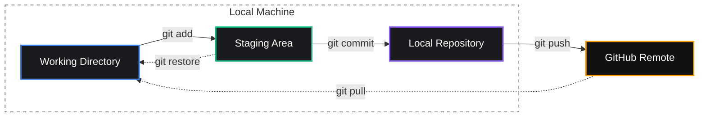

import { Callout, Steps, Tabs, FileTree } from 'nextra/components'

# The Core Loop

<Callout type="info">
**Essential** | Estimated time: 45–60 minutes

এই সেকশনটি Git-এর মূল ভিত্তি (Core)। এখানে যা শিখবে সেটা প্রতিদিন ব্যবহার করবে — চাকরিতে হোক, client project-এ হোক, বা নিজের project-এ।

</Callout>

## What You'll Learn

- `git init` — নতুন project-এ Git শুরু করা
- `git clone` — GitHub থেকে project নামানো
- `git add` — কোন changes save করবে সেটা select করা
- `git commit` — changes permanently record করা
- `git push` — GitHub-এ upload করা
- `git pull` — GitHub থেকে latest changes নামানো
- `git status` এবং `git log` — কী হচ্ছে সেটা দেখা
- `.gitignore` — কোন files Git track করবে না সেটা বলা

## The Big Picture

Git কীভাবে কাজ করে এটা বোঝা খুব জরুরি। কাজ শুরু করার আগে একটা mental model বুঝে নাও। Git-এর মূল ওয়ার্কিং ফ্লো (Working Flow) অনুযায়ী তোমার কোড মূলত চারটি ধাপে বা জায়গায় কাজ করে:


```mermaid
graph LR
    subgraph Local [Local Machine]
    WD[Working Directory] -- "git add" --> SA[Staging Area]
    SA -- "git commit" --> LR[Local Repository]
    SA -. "git restore" .-> WD
    end

    LR -- "git push" --> GH[GitHub Remote]
    GH -. "git pull" .-> WD

    %% Styles
    style WD fill:#1a1b1e,stroke:#3b82f6,stroke-width:2px,color:#fff
    style SA fill:#1a1b1e,stroke:#10b981,stroke-width:2px,color:#fff
    style LR fill:#1a1b1e,stroke:#8b5cf6,stroke-width:2px,color:#fff
    style GH fill:#111,stroke:#f59e0b,stroke-width:2px,color:#fff

    style Local fill:none,stroke:#444,stroke-dasharray: 5 5
```

সহজ কথায়:

<Steps>
### Working Directory
তুমি file edit করো

### Staging Area
`git add` করো (save করার list-এ উঠল)

### Repository
`git commit` করো (permanently recorded)

### GitHub
`git push` করো (internet-এ গেল)
</Steps>

## Start Project

নতুন প্রোজেক্ট শুরু করা বা গিটহাব থেকে ক্লোন করার প্রক্রিয়া দেখে নাও।

<Tabs items={['Option A: নিজে শুরু (git init)', 'Option B: GitHub থেকে (git clone)']}>
  <Tabs.Tab>
    তুমি নতুন একটা project বানাচ্ছ, GitHub-এ এখনো কিছু নেই।

    ```bash filename="Terminal"
    # প্রথমে একটা folder বানাও
    mkdir my-first-project
    cd my-first-project

    # এই folder-এ Git চালু করো
    git init
    ```

    Output:
    ```
    Initialized empty Git repository in /home/you/my-first-project/.git/
    ```

    এর মানে `.git` নামে একটা hidden folder তৈরি হয়েছে। এই folder-এই Git তোমার সব history রাখে।

    <Callout type="info">
    `git init` শুধু একবার করতে হয় — project-এর শুরুতে। বারবার করতে হয় না।

    এই folder-টা GitHub-এ তুলতে হলে নিচের **Connect to GitHub** section দেখো। তার আগে অন্তত একটা commit করে নিতে হবে।
    </Callout>

  </Tabs.Tab>
  <Tabs.Tab>
    কোনো existing project আছে GitHub-এ, সেটা তোমার machine-এ নামাতে চাও।

    ```bash filename="Terminal"
    git clone git@github.com:username/repository-name.git
    ```

    উদাহরণ:
    ```bash filename="Terminal"
    git clone git@github.com:torvalds/linux.git
    ```

    এটা করলে:
    - একটা নতুন folder তৈরি হবে (`linux` নামে)
    - সব files নেমে আসবে
    - Git automatically configured থাকবে

    <Callout type="info">
    **কোথায় পাবে clone URL?**
    GitHub-এ repository-তে যাও → সবুজ **Code** button → **SSH** tab → URL copy করো।
    </Callout>

  </Tabs.Tab>
</Tabs>

## Daily Workflow

প্রতিদিনের কাজে যে গিট কমান্ডগুলো সবচেয়ে বেশি প্রয়োজন হবে।

এই তিনটা ধাপ তুমি প্রতিদিন বারবার করবে — দেখো, বাছো, সংরক্ষণ করো। পুরোটাই তোমার নিজের কম্পিউটারে হয়, ইন্টারনেট লাগে না।

GitHub-এ পাঠানোর কাজটা এর পরের section-এ আছে।

### Check Status

তোমার বর্তমান কাজের অবস্থা এবং ফাইলে কোনো পরিবর্তন এসেছে কিনা দেখে নাও।

কাজ শুরু করার আগে দেখো কী অবস্থা:

```bash filename="Terminal"
git status
```

নতুন repo-তে output:

```
On branch main

No commits yet

nothing to commit (create/copy files and start working)
```

একটা file বানানোর পর:

```bash filename="Terminal"
# একটা file বানাও
echo "# My First Project" > README.md

# আবার status দেখো
git status
```

Output:

```
On branch main

No commits yet

Untracked files:
  (use "git add <file>..." to include in what will be committed)
        README.md

nothing added to commit but untracked files present
```

**"Untracked"** মানে Git file-টা দেখতে পাচ্ছে, কিন্তু এখনো তার history রাখছে না। `git add` করলে তবেই Git এটাকে track করা শুরু করবে।

### Stage Changes

কোন পরিবর্তনগুলো সেভ করতে চাও সেগুলো স্টেজিং এরিয়াতে যোগ করো।

কোন changes save করতে চাও সেটা Git-কে বলো:

```bash filename="Terminal"
# একটা specific file add করো
git add README.md

# একাধিক file add করো
git add index.html style.css

# সব changes একসাথে add করো
git add .
```

<Callout type="warning">
**`git add .` সাবধানে ব্যবহার করো।**
এটা সব changed files একসাথে add করে। কাজের সময় অনেকে accidentally secret files বা বড় files add করে ফেলে। `.gitignore` শেখার পর এটা safer হবে (দেখো **Ignore Files** সেকশন)।

</Callout>

Add করার পর status দেখো:

```bash filename="Terminal"
git status
```

Output-এ `Changes to be committed:` এর মানে file Staging Area-এ আছে — commit করার জন্য ready।

### Permanent Commit

তোমার কাজের একটি স্থায়ী রেকর্ড বা স্ন্যাপশট তৈরি করো।

এখন permanently record করো:

```bash filename="Terminal"
git commit -m "Initial commit: add README"
```

Output:

```
[main (root-commit) a1b2c3d] Initial commit: add README
 1 file changed, 1 insertion(+)
 create mode 100644 README.md
```

`-m` flag মানে message। Quotation-এর ভেতরে তুমি লিখছ **এই commit-এ কী করলে।**

### Better Commits

পেশাদার এবং অর্থবহ কমিট মেসেজ লেখার কিছু গুরুত্বপূর্ণ নিয়ম।

Commit message হলো তোমার **কাজের diary**। ৬ মাস পর তুমি বা তোমার teammate যখন history দেখবে, তখন বুঝতে পারবে কে কী করেছিল।

<Tabs items={['Bad Messages', 'Good Messages']}>
  <Tabs.Tab>
    ```bash filename="Terminal"
    fix
    update
    changes
    asdf
    done
    ```
  </Tabs.Tab>
  <Tabs.Tab>
    ```bash filename="Terminal"
    Add user login page
    Fix broken navigation menu on mobile
    Remove unused CSS from homepage
    Update README with installation steps
    ```
  </Tabs.Tab>
</Tabs>

**নিয়ম:**

- Present tense লেখো ("Add" না "Added")
- ছোট রাখো — ৫০ character-এর মধ্যে
- কী করলে সেটা বলো, কেন করলে সেটা না হলেও চলে (ছোট changes-এ)

## Connect to GitHub

এখন পর্যন্ত সব কাজ তোমার নিজের কম্পিউটারে হয়েছে। GitHub-এ কিছু যায়নি।

এই section-এ তোমার local folder-টা GitHub-এর সাথে জুড়ে দেবে। **এটা প্রতিটা project-এ একবারই করতে হয়** — একবার জুড়ে গেলে পরে শুধু `git push` লিখলেই চলবে।

শুরু করার আগে নিশ্চিত হও তোমার অন্তত একটা commit আছে। খালি folder push করা যায় না।

```bash filename="Terminal"
git log --oneline
```

<Steps>
### Create an Empty Repo

GitHub-এ একটা **খালি** repository বানাও।

1. GitHub-এ যাও, ডানদিকে উপরে **+** চিহ্ন, তারপর **New repository**
2. Repository name দাও (local folder-এর নামের সাথে মিল রাখলে সুবিধা)
3. **Public** বা **Private** বেছে নাও
4. নিচের তিনটার কোনোটাতেই **tick দিও না** — "Add a README file", ".gitignore", "license"
5. **Create repository** চাপো

<Callout type="warning">
চার নম্বর ধাপটা সবচেয়ে জরুরি। Tick দিলে GitHub নিজেই একটা commit বানিয়ে ফেলে। তখন GitHub-এর history আর তোমার local history — দুটো আলাদা হয়ে যায়, আর push আটকে যায়। খালি repo হলে এই সমস্যা হয় না।

ভুলে tick দিয়ে ফেললেও সমাধান আছে — নিচের **Common Setup Errors** দেখো।
</Callout>

### Copy the URL

Repo বানানোর পর যে পাতাটা আসে, সেখানেই URL লেখা থাকে। **SSH** tab বেছে নাও, HTTPS না — কারণ [Setup](/docs/git-github/setup)-এ তুমি SSH key বানিয়েছ।

URL দেখতে এমন হবে:

```
git@github.com:username/my-first-project.git
```

পরে কখনো দরকার হলে repo-র পাতায় সবুজ **Code** button, তারপর **SSH** tab থেকে নিতে পারবে।

### Check Your Branch Name

Push করার আগে দেখে নাও তোমার branch-এর নাম কী।

```bash filename="Terminal"
git branch --show-current
```

`main` দেখালে ঠিক আছে, পরের ধাপে যাও।

`master` দেখালে নাম বদলে নাও। GitHub এখন `main` ধরে কাজ করে, তাই নাম না মিললে push fail করবে:

```bash filename="Terminal"
git branch -M main
```

`-M` মানে "নাম বদলাও, দরকার হলে জোর করে"। এটা তোমার কোনো কাজ মুছবে না, শুধু নামটা বদলাবে।

### Add the Remote

এবার Git-কে বলো তোমার কোড কোথায় পাঠাতে হবে।

```bash filename="Terminal"
git remote add origin git@github.com:username/my-first-project.git
```

এখানে `origin` হলো ওই ঠিকানার একটা **ডাকনাম**, যেটা তুমি নিজে দিচ্ছ। Git এই নাম নিজে থেকে দেয় না। `myserver` লিখলেও কাজ করত। সবাই `origin` লেখে বলে এটাই প্রচলন হয়ে গেছে।

ঠিকমতো যোগ হয়েছে কিনা দেখে নাও:

```bash filename="Terminal"
git remote -v
```

### Push for the First Time

```bash filename="Terminal"
git push -u origin main
```

এই লাইনটা পড়ো এভাবে: "`main` branch-টা `origin` নামের ঠিকানায় পাঠাও, আর মনে রাখো।"

`-u` অংশটাই "মনে রাখো" বলে। এর পর থেকে শুধু `git push` লিখলেই Git জানবে কোথায় পাঠাতে হবে।

### Verify

GitHub-এ repo-র পাতাটা refresh করো। তোমার সব file দেখা যাচ্ছে? তাহলে কাজ শেষ।

</Steps>

### Common Setup Errors

এই চারটা error প্রায় সবার প্রথমবার আসে। ভয়ের কিছু নেই — প্রতিটার সহজ সমাধান আছে।

<Tabs items={['remote already exists', 'src refspec main', 'rejected / fetch first', 'Permission denied']}>
  <Tabs.Tab>
    ```
    fatal: remote origin already exists.
    ```

    **কারণ:** তুমি আগেই একবার `git remote add origin` চালিয়েছ।

    **সমাধান:** নতুন করে যোগ না করে পুরনো ঠিকানাটা বদলে দাও:

    ```bash filename="Terminal"
    git remote set-url origin git@github.com:username/my-first-project.git
    git remote -v
    ```
  </Tabs.Tab>
  <Tabs.Tab>
    ```
    error: src refspec main does not match any
    ```

    **কারণ:** `main` নামে কোনো branch নেই। সাধারণত দুটোর একটা — branch-এর নাম `master`, অথবা তুমি এখনো একটাও commit করোনি।

    **সমাধান:**

    ```bash filename="Terminal"
    git log --oneline           # commit আছে কিনা দেখো
    git branch --show-current   # নাম কী দেখো
    git branch -M main          # master হলে বদলাও
    ```
  </Tabs.Tab>
  <Tabs.Tab>
    ```
    ! [rejected]  main -> main (fetch first)
    ```

    **কারণ:** GitHub-এ এমন commit আছে যেটা তোমার কাছে নেই। প্রায় সবসময় এর মানে repo বানানোর সময় তুমি "Add a README file"-এ tick দিয়েছিলে।

    **সমাধান:** GitHub-এর কাজটুকু আগে নামিয়ে নিজের কাজের সাথে জুড়ে দাও, তারপর push করো:

    ```bash filename="Terminal"
    git pull origin main --allow-unrelated-histories
    git push -u origin main
    ```

    `--allow-unrelated-histories` লাগে কারণ দুটো history আলাদাভাবে শুরু হয়েছিল। Git সাধারণত এটা করতে চায় না, তাই স্পষ্ট করে অনুমতি দিতে হয়।
  </Tabs.Tab>
  <Tabs.Tab>
    ```
    git@github.com: Permission denied (publickey).
    ```

    **কারণ:** GitHub তোমাকে চিনতে পারছে না। SSH key হয় বানানো হয়নি, নয় GitHub-এ যোগ করা হয়নি।

    **সমাধান:** আগে connection পরীক্ষা করো:

    ```bash filename="Terminal"
    ssh -T git@github.com
    ```

    `Hi username!` না দেখালে [Setup](/docs/git-github/setup) পেজের **SSH Key** অংশটা আবার করো।
  </Tabs.Tab>
</Tabs>

## Push and Pull

Connection একবার হয়ে গেছে। এখন প্রতিদিনের কাজ মাত্র দুটো কমান্ড।

### Push Changes

তোমার commit গুলো GitHub-এ পাঠাও।

```bash filename="Terminal"
git push
```

প্রথমবার `-u` দিয়েছিলে বলে এখন আর `origin main` লিখতে হচ্ছে না।

### Pull Changes

GitHub থেকে নতুন পরিবর্তন তোমার মেশিনে নামাও।

Team-এ কাজ করলে, বা তুমি নিজেই অন্য কম্পিউটার থেকে কাজ করলে, GitHub-এ নতুন commit থাকতে পারে। সেগুলো আগে নামিয়ে নাও:

```bash filename="Terminal"
git pull
```

<Callout type="info">
  **অভ্যাস করে ফেলো:** কাজ শুরু করার আগে সবসময় `git pull`। এতে তুমি সবচেয়ে নতুন code নিয়ে কাজ শুরু করবে, আর পরে conflict কম হবে।
</Callout>

## View History

তোমার প্রোজেক্টের সব কমিট বা কাজের ইতিহাস একনজরে দেখে নাও।

তোমার সব commits দেখতে:

```bash filename="Terminal"
git log
```

একটু সংক্ষেপে দেখতে:

```bash filename="Terminal"
git log --oneline
```

Output:

```
e4f5g6h Add contact page
a1b2c3d Initial commit: add README
```

## Ignore Files

যে ফাইলগুলো তুমি গিটে রাখতে চাও না সেগুলো ইগনোর করার নিয়ম।

কিছু files আছে যেগুলো Git-এ রাখা উচিত না। এগুলো ignore করতে project root-এ `.gitignore` নামে একটা file বানাও:

<FileTree>
  <FileTree.Folder name="my-first-project" defaultOpen>
    <FileTree.Folder name=".git" />
    <FileTree.Folder name="node_modules" />
    <FileTree.File name=".env" />
    <FileTree.File name=".gitignore" />
    <FileTree.File name="README.md" />
  </FileTree.Folder>
</FileTree>

File-এর ভেতরে লেখো:

```
# Dependencies
node_modules/

# Environment variables (NEVER commit this!)
.env
.env.local

# OS files
.DS_Store
```

<Callout type="error">
  **সবচেয়ে বড় ভুল:** `.env` file commit করে GitHub-এ push করা। এতে তোমার API
  keys, database passwords সব public হয়ে যায়। সবসময় `.env` কে `.gitignore`-এ
  রাখো।
</Callout>

## Full Workflow

প্রতিদিনের কাজ শুরু থেকে শেষ করার একটি আদর্শ গিট ওয়ার্কফ্লো।

এটাই তুমি প্রতিদিন করবে:

<Steps>
### Pull Latest
কাজ শুরুর আগে latest pull করো `git pull`

### Work

কাজ করো (files edit করো)

### Inspect Status

কী কী change হয়েছে দেখো `git status`

### Stage Changes

Changes stage করো `git add .`

### Commit

Commit করো `git commit -m "Add feature"`

### Push

GitHub-এ push করো `git push`

</Steps>

## Common Problems & Fixes

প্রথমবার GitHub-এ connect করার error গুলো উপরে **Common Setup Errors**-এ আছে। এখানে প্রতিদিনের কাজের সময় যেগুলো আসে।

<Tabs items={['Push Error', 'Nothing to commit', 'Wrong Message', 'Wrong File Added']}>
  <Tabs.Tab>
    ```
    error: failed to push some refs...
    ```
    **কারণ:** তুমি শেষবার pull করার পর teammate নতুন commit push করেছে। GitHub চায় আগে তুমি সেগুলো নিয়ে নাও।

    **Fix:**

    ```bash filename="Terminal"
    git pull
    git push
    ```

    Conflict এলে সেটা মিটিয়ে তারপর push করো — কীভাবে, সেটা [Branching & Merging](/docs/git-github/branching)-এ আছে।
  </Tabs.Tab>
  <Tabs.Tab>
    ```
    nothing to commit, working tree clean
    ```
    **কারণ:** তুমি `git add` করোনি অথবা সত্যিই কোনো change নেই।
    **Fix:** `git status` দিয়ে দেখো.
  </Tabs.Tab>
  <Tabs.Tab>
    Push করার আগে message ভুল হলে:
    ```bash filename="Terminal"
    git commit --amend -m "সঠিক message এখানে"
    ```
    <Callout type="warning">Push করার পরে amend করবে না!</Callout>
  </Tabs.Tab>
  <Tabs.Tab>
    ```bash filename="Terminal"
    # Staging থেকে বাদ দাও (file delete হবে না)
    git restore --staged filename.txt

    # সব unstage করতে
    git restore --staged .
    ```

  </Tabs.Tab>
</Tabs>

## Real-World Note

<Callout type="warning">
  **Commit করা মানে চিরকালের জন্য লেখা — শুধু কোড না, আরও অনেক কিছু।**

  প্রতিটা commit-এর সাথে Git তোমার **নাম আর email** জুড়ে দেয়, আর push করলে সেটা সবার জন্য পড়ার মতো হয়ে যায়। GitHub-এর public API দিয়ে যে কেউ যেকোনো repository-র সব commit-এর email তুলে নিতে পারে। Spam আর phishing-এর জন্য এভাবেই developer-দের email সংগ্রহ করা হয়।

  চাইলে GitHub তোমাকে একটা আড়াল করা email দেয়। **Settings → Emails → Keep my email address private** চালু করো, তারপর যে `noreply` ঠিকানাটা দেখাবে সেটা Git-এ বসাও:

  ```bash filename="Terminal"
  git config --global user.email "12345678+username@users.noreply.github.com"
  ```

  তবে সবচেয়ে বড় ঝুঁকি email না — **`git add .`**। এই একটা কমান্ড folder-এর সব কিছু তুলে নেয়। যা সবচেয়ে বেশি ভুল করে ঢুকে যায়:

  - `.env` — API key, database password
  - `config.json`, `credentials.json` — cloud service-এর key
  - `.pem`, `.key` — private key file
  - `dump.sql` — আসল customer data সহ database backup

  তাই `.gitignore` আগে বানাও, তারপর প্রথম commit করো। আর `git add .` দেওয়ার পর commit করার আগে একবার দেখে নাও কী কী উঠল:

  ```bash filename="Terminal"
  git status              # কোন file গুলো যাচ্ছে
  git diff --staged       # ভেতরে ঠিক কী যাচ্ছে
  ```

  ভুলে push হয়ে গেলে `.gitignore`-এ যোগ করলেই যথেষ্ট না — commit-টা history-তে থেকে যায় আর URL দিয়ে পড়া যায়। তখন কী করতে হয় সেটা [Undo & Recovery](/docs/git-github/undo-and-recovery)-তে আছে। এক কথায়: **আগে key বাতিল করো, তারপর file সরাও।**
</Callout>

## What's Next?

Daily workflow শেখা হয়ে গেছে। এখন শিখবে Git-এর সবচেয়ে powerful feature —

<Callout type="info">
**→ Branching & Merging**

একই project-এ একাধিক কাজ একসাথে করা, team-এর সাথে conflict ছাড়া কাজ করা — সব এখানে।

</Callout>

**পরবর্তী →** [Branching & Merging](/docs/git-github/branching)

<span style={{ display: 'none' }}>
  Search Keywords: git add bangla, git commit bangla, git push, git pull, git status, gitignore bangla, track files, git stage, git commit message rules, github noreply email privacy
</span>
